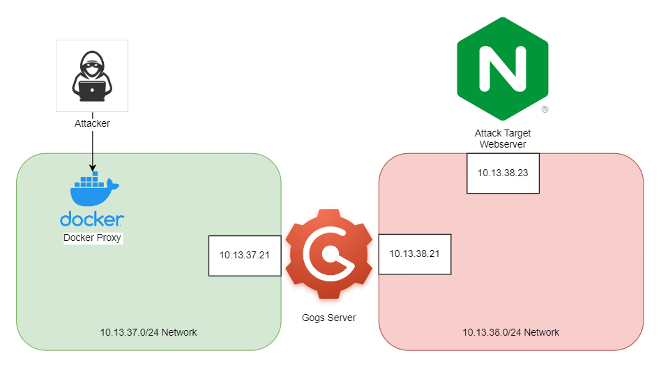
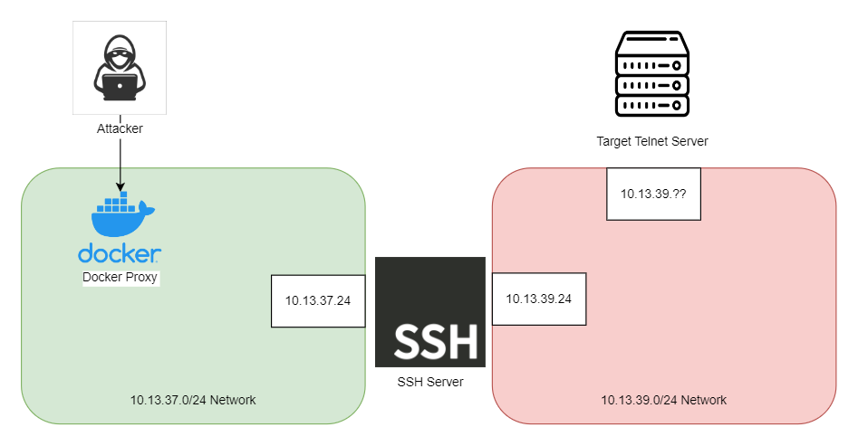

# Pivot lab
This lab is composed of multiple independent challenges that demonstrate some sort of network pivoting to reach the end goal of accessing resources on an internal network. It is recommended to work through these challenges on a Kali Linux Virtual Machine.

## SSRF Challenge

## SSH Challenge

