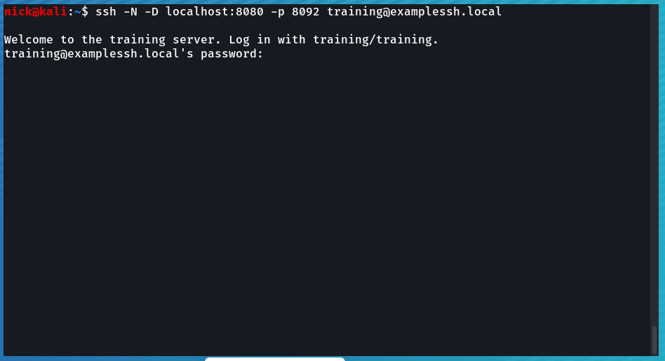
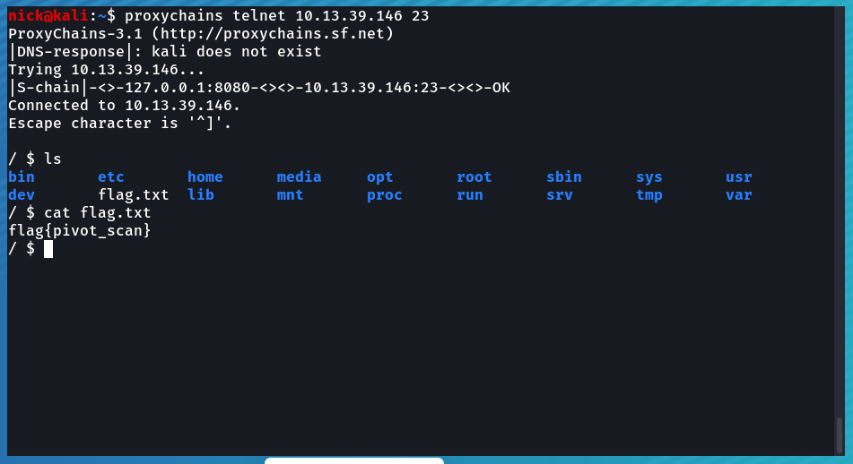

# SSH Pivot Challenge

## About SSH

SSH, which stands for Secure Shell, is a cryptographic network protocol used for securely accessing and managing remote systems over an unsecured network, such as the internet. It provides a secure channel between two computers, allowing data to be exchanged securely and encrypted. SSH is commonly used by system administrators, developers, and other users to perform various tasks on remote servers and devices. 

SSH can also create encrypted tunnels for port forwarding, allowing users to securely access services running on the remote server as if they were running locally. There is a requirement that the remote server is configured to allow for this.

## Lab Network

The relevant parts of the lab network for this exercise can be seen in the following image.

## Goal And Targets

We can access the SSH server through the Docker proxy at <SelfLink protocol="ssh://" port=8092 path="" />. Our goal is to access the unauthenticated telnet service running on TCP port 23 of an unknown host on the 10.13.39.0/24 network by pivoting through the SSH server and performing a network scan to discover the target IP.

## Initial Enumeration And Research

We can open a terminal on our Kali Linux Virtual Machine and attempt to ssh to the SSH server on the above specified port. We will be prompted if we want to accept the host fingerprint, and can enter `yes`. 

We can see a server banner has been set on the remote SSH server that tells us to connect with the "training/training" credentials. We can press ^C (Control + C) to interrupt this attempt at logging in, and change our command to connect as the "training" user. 

We can enter "training" as the password, and upon hitting enter, we will see that we have logged in successfully, but not to a traditional shell.

Instead, it appears the user has been configured to log in with the [sl](https://man.archlinux.org/man/sl.1.en) program set as its shell. When the train crosses the screen, the program terminates, as does our SSH session. It would seem that there is not much that we can do with the credentials that we have, as instead of being dropped into an interactive shell, we are dropped into a non interactive program that has very little attack surface. Fortunately for us, being able to authenticate as a user over SSH potentially has a much larger impact beyond just the shell program the user is dropped into upon connecting. We would like to know the version of the SSH server that the remote server is running so that we can better understand its feature set, as well as potential common misconfigurations or disclosed vulnerabilities.

To do this, we can connect to the remote SSH server with the netcat tool, [nc](https://linux.die.net/man/1/nc). We can specify the remote hostname and port to open a TCP connection to, and the SSH server will respond with the version it is running.

We can see that the remote SSH server is running the ssh 2.0 protocol on the OpenSSH 9.3 server. At the time this is written, this is a fairly up to date and secure SSH server implementation and unlikely that we will find useful disclosed vulnerabilities. Knowing that it is running OpenSSH gives us some idea of the capabilities supported as well as ideas about how potential misconfigurations might occur.

## Understanding SSH Port Forwarding

SSH port forwarding, also known as SSH tunneling, is a feature in OpenSSH that securely forwards network connections between computers. It has three types: local (forwarding local machine to remote server), remote (forwarding remote server to local machine), and dynamic (creating a SOCKS proxy). OpenSSH server has settings that can enable or disable this feature. In our case, we are hoping that dynamic port forwarding is enabled as it will allow us to port scan through the remote SSH server.

If we reference the OpenSSH client [manual](https://linux.die.net/man/1/ssh) we can see that the -D flag can be used to attempt to bind a local SOCKS proxy that will send traffic over the SSH tunnel through the remote server. We can specify `-D localhost:8080` to attempt to bind a SOCKS proxy. If we do this and attempt to connect to the remote server, our connection will be dropped after the sl program finishes executing. To prevent this we can also specify the `-N` flag, which tell the server to not even bother executing the shell of the user we are logging in as.

If the server is configured to allow for dynamic port forwarding, we will successfully be able to send traffic through the SOCKS proxy we have bound locally on port 8080. Otherwise, it will fail and we will get an error message. We want to ensure this connection is active for the next parts, and may want to open another terminal window to continue in.

## Understanding SOCKS

SOCKS proxies are intermediaries between clients and servers that help in secure, private internet access. Clients connect to the proxy server instead of the destination server, hiding their IP addresses. The proxy server then communicates with the destination server on behalf of the client, keeping the client's identity hidden. SOCKS5 is the most common version, supporting both TCP and UDP connections and providing authentication and DNS resolution features.

In the case of dynamic port forwarding over SSH, we are able to send traffic through a local SOCKS proxy server that actually dynamically tunnels all its traffic over SSH through the remote server. This allows us to make requests on behalf of the remote SSH server.

We can configure the [proxychains](https://manpages.ubuntu.com/manpages/focal/man1/proxychains3.1.html) utility to attempt to send traffic through the local SOCKS proxy we have bound. We can edit the /etc/proxychains.conf file on our Kali VM to point to the SOCKS proxy we have bound. We will need to open a text editor as root to modify this file. You can run `sudo nano /etc/proxychains.conf` to open the file as root in the nano text editor. You will want to scroll down to the bottom of the file and modify the last line to say `socks5 127.0.0.1 8080` to point at our local SOCKS proxy, using the SOCKS5 protocol.

We can save the file with ^O (Control + O) and close the file with ^X (Control + X). We can now use the `proxychains` command to intercept the network requests of other commands and attempt to send them through the SOCKS proxy. To test if the remote server even permits us to do dynamic port forwarding and if the SOCKS proxy even works, we can do the same netcat version grabbing trick from before, but this time putting `proxychains` before the command. If the server is misconfigured to allow for dynamic port forwarding, we will get a response back, otherwise, we will get an error.

We see that the connection was successfully sent through the SOCKS proxy and that we got a response back. This means that the remote SSH server does allow for us to do dynamic port forwarding, and that we can open network connections on behalf of the remote SSH server.

## Port Scanning through SOCKS

Port scanning is the process of checking a target's network ports to see which ones are open, closed, or filtered. [Nmap](https://linux.die.net/man/1/nmap) is a widely used tool for performing port scans and network exploration. In our case, we want to perform discovery of a host on the 10.13.39.0/24 network that is known to have port 23 open. We are now able to make connections through the remote SSH server, which is on this network. We can use the nmap tool and proxychains to scan the internal network for the target host.

We want to discover hosts on the 10.13.39.0/24 network with the TCP port 23 open, and we want the connection attempts to be made through the remote SSH server. To do this, we can run `proxychains nmap -Pn -T 5 -p 23 --open 10.13.39.0/24`. The -Pn flag will prevent "host discovery" checks on port 80 to the host and the -T 5 flag sets the threat level to the timing template to the most aggressive option. The --open flag will only show results for open ports.

This scan may take a while, and we will see the connections to IPs in the network range we are scanning being made. We can wait for it to complete, but when it does, we will get a report of IPs with port TCP 23 open on the internal network.

We see that the 10.13.39.146 host has port 23 open. We have found our target server.

## Connecting To Our Target

We can use the same proxychains setup we already have to telnet to the target server. We can use the `proxychains telnet 10.13.39.146 23` command to connect through our SOCKS proxy, through the remote SSH server, to the target telnet server we discovered on the internal network.

We see that we can successfully connect over telnet, and that there is no authorization and that we are dropped into a shell. We can run an `ls` command to see a `flag.txt` file and concatenate it out to stdout to view its content and reach the target of finding the sensitive information on the internal target network.

## Conclusion

We were able to discover and access the internal target telnet server by pivoting through the misconfigured SSH server. We were able to find credentials for a very low privilege user in the SSH banner and able to check the version to better understand what it might support. From there, we were able to check if it had been configured to allow for dynamic port forwarding, and determined that it was. We were able to abuse this feature being enabled and scan the internal private network for the host we wanted to attack. We were able to use the discovered target host IP and connect through the SSH server's dynamic port forwarding to access the unauthenticated telnet server on the private network and leak the sensitive information it had.
