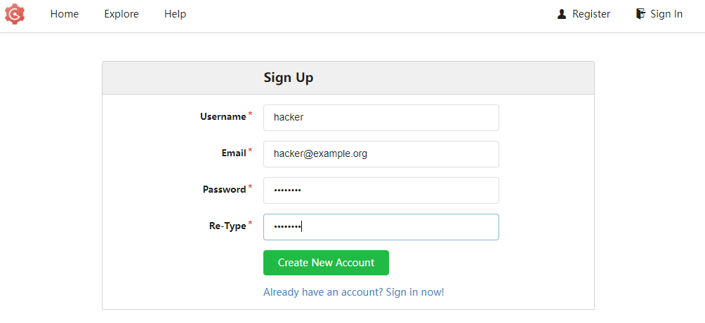

# SSRF Pivot Challenge

## What is SSRF?

In the words of [OWASP](https://owasp.org/www-community/attacks/Server_Side_Request_Forgery)
> In a Server-Side Request Forgery (SSRF) attack, the attacker can abuse functionality on the server to read or update internal resources. The attacker can supply or modify a URL which the code running on the server will read or submit data to, and by carefully selecting the URLs, the attacker may be able to read server configuration such as AWS metadata, connect to internal services like http enabled databases or perform post requests towards internal services which are not intended to be exposed. 

In the context of this lab, we will be abusing an SSRF vulnerability in an old version of Gogs, a self-hosted git service, to access a webserver on an internal network that the Gogs server is on.

## Lab Network

The relevant parts of the lab network for this exercise can be seen in the following image.

We are able to access the Gogs server on the first green network through the docker proxy. The Gogs server has two network interface, one on the green network, and one on the red network. Our goal is to exploit the Gogs server to make requests on our behalf to the Attack Target Webserver that is on the otherwise inaccessible private red network.

## Goal And Targets

We can access the Gogs server through the Docker proxy at <SelfLink port=8091 />. Our goal is to access the webserver running on port 8080 of the 10.13.38.23 host by pivoting through the Gogs server.

## What is Gogs?

Before we try to attack a Gogs server instance, it will help us a lot to do some research into what Gogs is, so we can better understand the features and intended function of the application we are trying to exploit. We can look at their [website](https://gogs.io/) to get a better idea of what their software does.
> Gogs is a self-hosted Git service that provides a simplified and user-friendly interface for managing and hosting Git repositories. Git itself is a popular version control system that allows developers to track changes in their codebase and collaborate with others effectively.
> Gogs aims to make Git more accessible and easier to use for individuals and small teams by providing a lightweight and streamlined platform. It offers a web-based interface that allows users to create, clone, and manage repositories, as well as perform typical Git operations like branching, merging, and committing code changes.

## Initial Enumeration And Research

We can navigate to the <SelfLink linkText="Gogs server" port=8091 /> in our web browser to view the following page.

We see some buttons to register and to sign in, and we see some information about the Gogs service that is running. In the footer we see`2018 Gogs Version: 0.11.43.0330`, telling us the version of Gogs that is running. The service seems potentially quite out of date, running a version from 2018. Given that we have the exact version number, we can search online for vulnerabilities in Gogs that might affect this old version. Searching online for Gogs vulnerabilities, we can find the [CVE Details](https://www.cvedetails.com/vulnerability-list/vendor_id-19134/product_id-49155/Gogs-Gogs.html) page, a site that aggregates NIST NVD CVE vulnerability data to be better searchable.

Looking at some of the vulnerabilities patched in 2018 for Gogs, we can see there are a few that look potentially interesting to us. We see a couple of SSRF vulnerabilities that may be present in the version of the service we are attacking. For the purpose of the lab, we will skip past the normal process of reading the details on several CVEs until we find one that looks like it might be exploitable in our scenario, and will move directly on to looking at [CVE-2018-15192](https://www.cvedetails.com/cve/CVE-2018-15192/).

We can see here that this exploit allows for SSRF that allows remote attackers to access internal network services in Gogs versions before 0.11.53 without the need for authenticating as a privileged user on the service. Our instance is on 0.11.43, so this seems like a promising vulnerability for us to try to exploit. Scrolling down to the references section, we can see a [link](https://github.com/gogs/gogs/issues/5366) to a Gogs issue on GitHub that gives us more details of how this vulnerability works.

In the issue, we see the following quote.
> when an attacker is able to set the url of webhooks , he may set it to an internal address.

We also see a screenshot of what looks to be the Gogs web UI and a request and response to an internal address.

Seeing this, it looks like if we start poking around with target Gogs service, we may be able to exploit this vulnerability and abuse the webhook feature for repositories to access internal network resources.

## Poking Around Gogs

To be able to access the webhook functionality of Gogs we will need to create a new repository. To do this, we will first need to register an account. We can click the register button on the main page to navigate to the <SelfLink linkText="registration page" port=8091 path="/user/sign_up" />. We can fill out the registration form, and click on the green "Create New Account" button.

If successful, this will redirect us to the login page, and we can log in with the credentials of the account we just created. If successful, we will be signed in and navigated to a page that should look similar to the following.

Now that we have an account, we can create a new repository so that we can try to access the webhook features for it. We can click the blue "+" next to the "My Repositories" text. This will take us to the page for creating a new repository.

We can enter a name for the repo, and a description if we so choose. We need to make sure to check the "Initialize this repository with selected files and template" box so that the repository is created with an initial git repo. Otherwise, due to a bug in this version of Gogs, webhooks will fail to work properly. From here, we can click the green "Create Repository" button. If successful, this will navigate us to the view of our new repository.

We now see a view of the repository we created. We can see several details about it and buttons, but we are interesting on click on the "Settings" button and then clicking on the "Webhooks" pane.

## Abusing The Webhooks Vulnerability

Webhooks are a feature offered by Gogs, and most other similar git services.
> In Gogs, webhooks play a crucial role in facilitating automated workflows and integrations with external systems. Webhooks are a feature that allows Gogs to send notifications or trigger actions in other applications or services whenever specific events occur within the repository.

We can create a webhook on the repository that will cause Gogs to make an HTTP POST request to the URL we provide with an event payload whenever certain events occur on the repo. We can click the "Add Webhook" button and we will be offered a dropdown list of different webhook payload formats. Different commonly used services expect different payloads in the body of the webhook. For our purposes, we are not too concerned about the payload body and will select the "Gogs" option.

Clicking this will take us to the view for adding a webhook. We can enter our target address we are trying to access, http://10.13.38.23:8080, as the payload URL. This is a private internal address, and if the application was not vulnerable, it would not accept this address as a valid webhook URL. We can leave the rest of the settings as they are and click "Add Webhook."

Once the webhook has been created, it will show up in the settings for webhooks and we can click the pencil button to go in and edit it.

On the webhook editing page, we can see a "Test Delivery" button. This is what makes this SSRF vulnerability so useful. Normally, when a repo event triggers a webhook request being made, we wouldn't have any way to see the response from the webhook server. It may be possible on some implementations that provide verbose logs, but in our case, that is not necessary. If we click the "Test Delivery" button, we can see the request made to the webhook URL and the response.

We can click on the recent delivery and click on the response section to see the response from the internal target webserver. We can see the response headers and the response body and see that we have successfully reached the target Nginx webserver.

Following the instructions from the request, we see that in order to pull the sensitive information that the internal target webserver has on it, we need to make a request with the "getflag" query parameter set. We can scroll back up and modify our webhook url to include `/?getflag=true` to the URL and click the "Update Webhook" button.

We can scroll back down and send another test delivery with the modified URL. Once it completes, we can look at the response and see that we were successfully able to exploit Gogs to access the internal target webserver and get the sensitive information from it.

## Conclusion

We were able to access the internal target webserver by pivoting through the publicly accessible Gogs server. We were able to find version information for the Gogs server and research disclosed vulnerabilities that might affect it. From there, we were able to find a likely relevant vulnerability and confirm its presence against the instance. We were able to use this vulnerability to access the internal target webserver and leak the sensitive information it had.
