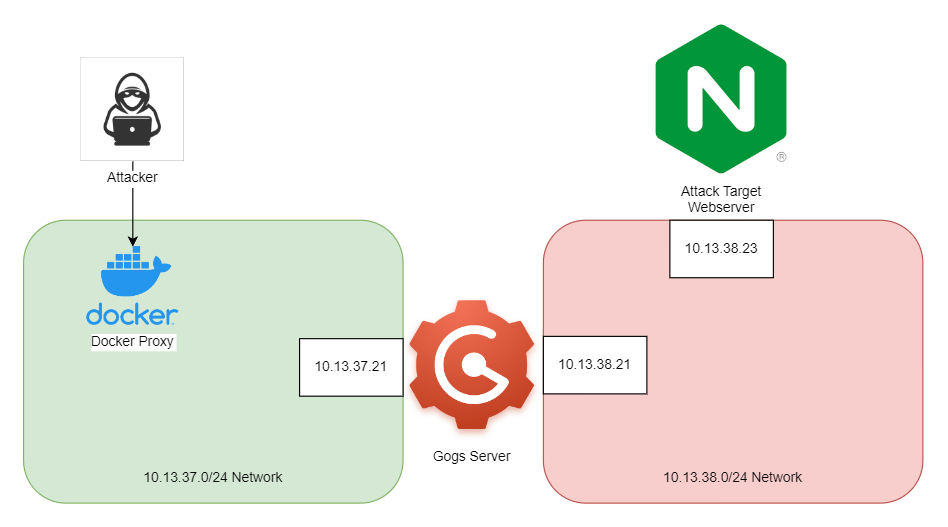

# SSRF Pivot Challenge

## What is SSRF?

In the words of [OWASP](https://owasp.org/www-community/attacks/Server_Side_Request_Forgery)
> In a Server-Side Request Forgery (SSRF) attack, the attacker can abuse functionality on the server to read or update internal resources. The attacker can supply or modify a URL which the code running on the server will read or submit data to, and by carefully selecting the URLs, the attacker may be able to read server configuration such as AWS metadata, connect to internal services like http enabled databases or perform post requests towards internal services which are not intended to be exposed. 

In the context of this lab, we will be abusing an SSRF vulnerability in an old version of Gogs, a self-hosted git service, to access a webserver on an internal network that the Gogs server is on.

## Lab Network

The relevant parts of the lab network for this exercise can be seen in the following image.

We are able to access the Gogs server on the first green network through the docker proxy. The Gogs server has two network interface, one on the green network, and one on the red network. Our goal is to exploit the Gogs server to make requests on our behalf to the Attack Target Webserver that is on the otherwise inaccessible private red network.

## Goal And Targets

We can access the Gogs server through the Docker proxy at <SelfLink port=8091 />. Our goal is to access the webserver running on port 8080 of the 10.13.38.23 host by pivoting through the Gogs server.

## [Walkthrough](/lab/ssrf.html)

For a walkthrough on actually doing this, you can follow the full documentation [here.](/lab/ssrf.html) If you want to try doing this on your own for a while and reference the walkthrough if you get stuck, that is also an option.
